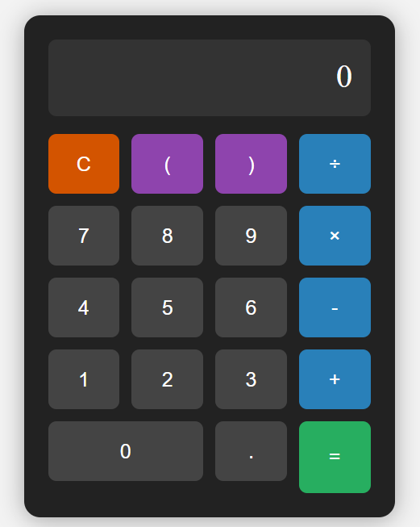

# 🔢 Basic Calculator

This is a simple and interactive calculator built using **HTML**, **CSS**, and **JavaScript**. It performs basic arithmetic operations and supports both mouse and keyboard inputs.

## 🚀 How to Use

### 💻 Opening the Calculator

1. Download or clone this repository.
2. Open the `index.html` file in your browser.

### 🖱️ Using Mouse

- Click number buttons (0–9) to enter values.
- Use operators (`+`, `−`, `×`, `÷`) to build expressions.
- Use `(` and `)` to group parts of expressions.
- Click the `C` button to clear the input.
- Click `=` to evaluate and see the result.

### ⌨️ Using Keyboard

- You can type directly using your keyboard:
  - Numbers: `0`–`9`
  - Operators: `+`, `-`, `*`, `/`
  - Brackets: `(`, `)`
  - Decimal: `.`
- Press `Enter` or `=` to calculate the result.
- Press `C` or `Escape` to clear the display.

## 🧠 Features

- ✔️ Basic operations: addition, subtraction, multiplication, division.
- 🔄 Follows **BODMAS** rules (order of operations).
- 🧮 Supports parentheses for grouping.
- ⚠️ Displays "Error" for invalid expressions.
- 🖥️ Supports both mouse and keyboard inputs.
- 🎨 Modern and responsive design using CSS.

## 📸 Preview

## ✨ Author

Developed by **Vikalp Pratap Singh**

---

