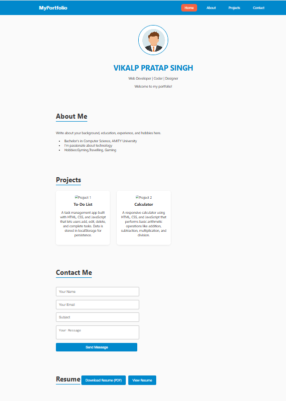

# 🌐 Personal Portfolio Website

This is a responsive and modern **personal portfolio website** built using **HTML**, **CSS**, and **JavaScript**. It includes sections for Home, About, Projects, Contact, and Resume. The site highlights your skills, showcases your projects, and provides a way for others to contact you.

## ✨ Features

- **Sticky Navigation Bar** with smooth scrolling.
- **Home Section** with name, profile photo, and introduction.
- **About Section** with education, hobbies, and background.
- **Projects Gallery** with images, descriptions, and hover effects.
- **Contact Form** with basic validation.
- **Resume Section** to view and download your resume.
- Fully **responsive design** for mobile and desktop views.
- JavaScript for **scroll tracking** and **form validation**.

---
## How to use
Explore the sections using the top navigation bar:
   - **Home**: View name, bio, and profile image.
   - **About**: Learn more about your background.
   - **Projects**: View your work with images and descriptions.
   - **Contact**: Fill and submit the form to send a message (simulated).
   - **Resume**: Download or view your resume (PDF).

## 🧠 Technologies Used

- **HTML5**
- **CSS3 (Flexbox, Media Queries, Custom Properties)**
- **Vanilla JavaScript (ES6)**

---

## 📸 Preview

### 🏠 Home Page

### 📂 Projects Section

---

## 📞 Contact Me

The **Contact** section includes a form that collects:
- Name
- Email
- Subject
- Message

The form uses basic JavaScript validation and gives feedback on submission.

---

## 📄 Resume

Users can:
- 🔽 **Download** your resume in PDF format
- 🔗 **View** it in a new browser tab

---

## 📸 Preview

## ✨ Author

Developed by **Vikalp Pratap Singh**

---

