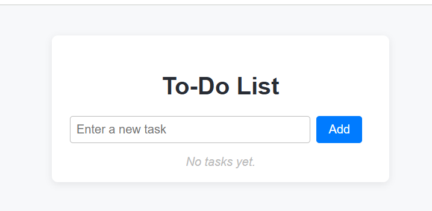

# ✅ To-Do List App

A simple, clean, and fully functional **To-Do List web app** built using **HTML**, **CSS**, and **JavaScript**. This app helps users manage daily tasks with options to **add**, **edit**, **delete**, and **mark** them as completed. It also uses **localStorage** to keep tasks even after the page is refreshed.

---

## 🧠 Features

- 📝 Add new tasks
- ✅ Mark tasks as completed
- ✏️ Edit tasks (inline editing)
- ❌ Delete tasks
- 💾 Saves tasks using `localStorage`
- 📱 Fully responsive for mobile and desktop
- ⚠️ Error handling for empty input
- 🧼 Clean and intuitive UI

---

## 💻 How to Use

 Type a task into the input field and click **"Add"** or press Enter.
 Use the **checkbox** to mark a task as done.
 Click **Edit** to modify a task or **Delete** to remove it.
 Double-click a task name to start editing it directly.
 All tasks are saved automatically in your browser.

---

## 📸 Preview

## ✨ Author

Developed by **Vikalp Pratap Singh**

---

